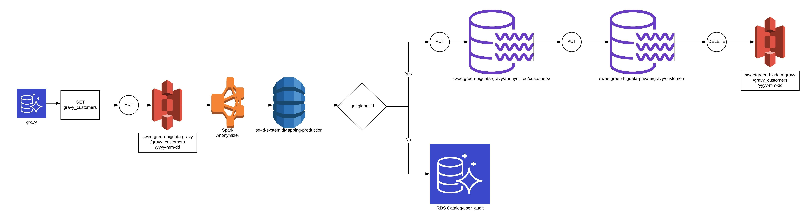
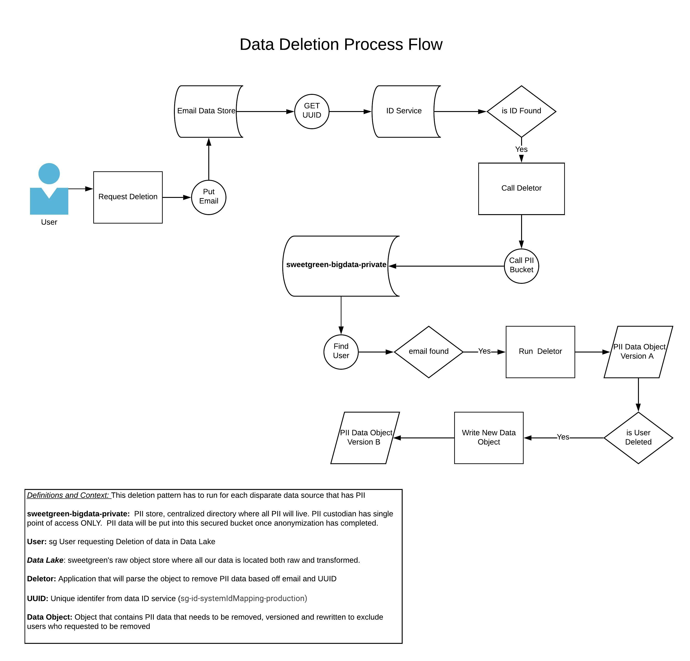

# poly-spark-ccpa

Scanning application to de-identify and delete objects from generic Data Lake to replace/remove PII data to be fully anonymized

**Process**

**Workflow**

**Deletion**

Dependencies:
- Java 8 
- Spark 2.4.4
- Scala 2.11.12

**Application Arguments:**

| Argument        | Sample           | Required  |
| ------------- |:-------------:| -----:|
| source bucket path     | s3 bucket source path| YES |
| target bucket path     | s3 bucket target path| YES |
| file format | GZIP/ORC   |    YES |  
| source name | filter app to source name i.e. gravy_users   |   YES |  

:TODO Add Verbose Read.me

*Since it's using maven as the build tool you need to install a local repo on machine in order
to generate dependant libraries within the pom.xml file. 

    Follow this tutorial to setup quickly:
    install: 
     1. manual: https://maven.apache.org/install.html
     2. homebrew (preferred): http://brewformulas.org/Maven
    quick guide: https://maven.apache.org/guides/getting-started/maven-in-five-minutes.html

MAVEN Project to rebuild run:
1. mvn clean
2. mvn package
3. will compile and generate package (.jar) 

ID DDB Writer
-

1. To run the Bulk Id Writer [click here](https://github.com/polyglotDataNerd/poly-spark-ccpa/tree/master/src/main/scala/com/poly/ccpa/utility#spark-utilities)